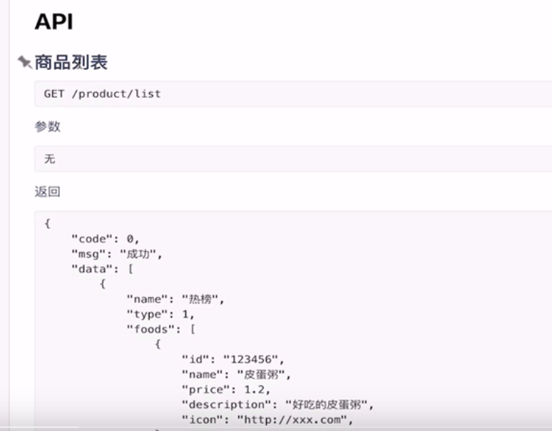
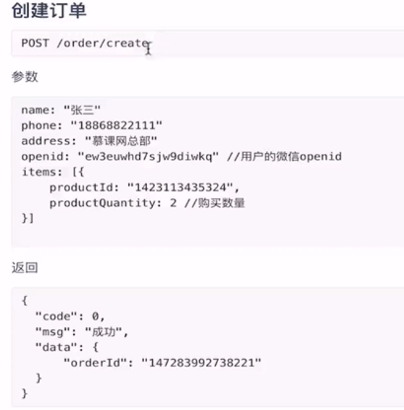

# repast

使用Spring cloud实现点餐业务的微服务架构。

## 项目结构图

## 数据库

### Product服务

**类目表：**

product_category

- id
- 类别名称
- 类别种类

**商品表：**

Product_info

- ID
- 名称
- 价格
- 描述
- 图片地址
- 商品库存
- 商品状态（0表示正常，1表示下架）
- 商品的类别（对应上表类别id）

### Order服务

**订单表：**

order_master

- id
- 买家名称
- 买家电话
- 买家Id
- 订单总金额
- 订单状态
- 支付状态

**订单中的详情.表：**

order_detail

- detail_id
- 所属订单id
- 商品id
- 商品名称
- 商品单价
- 数量
- 小图

## API接口

### Product服务

###  Order服务

## 其他